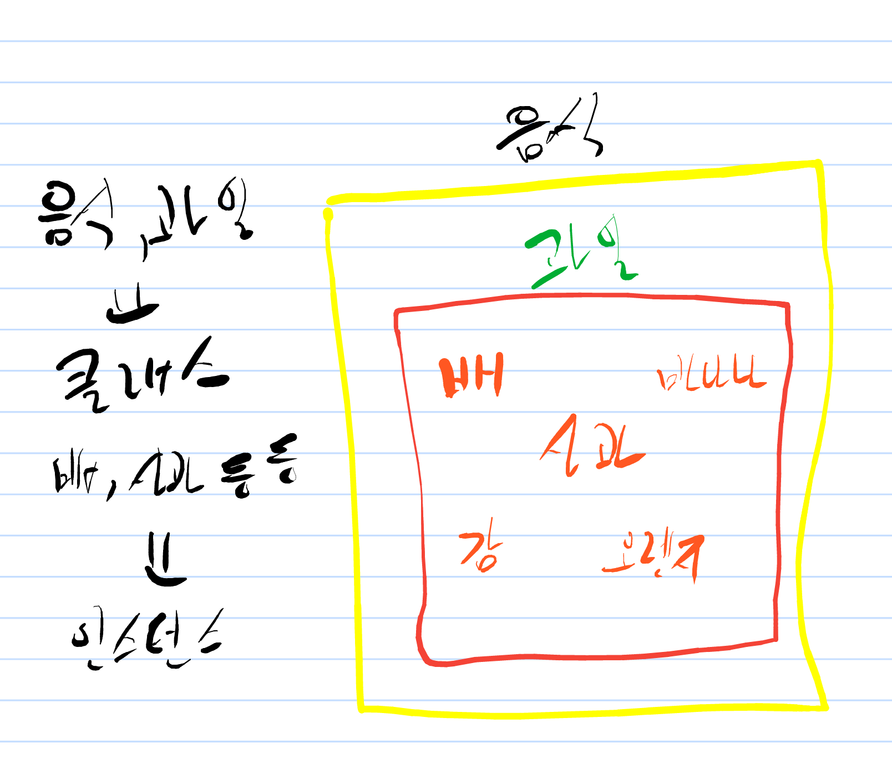
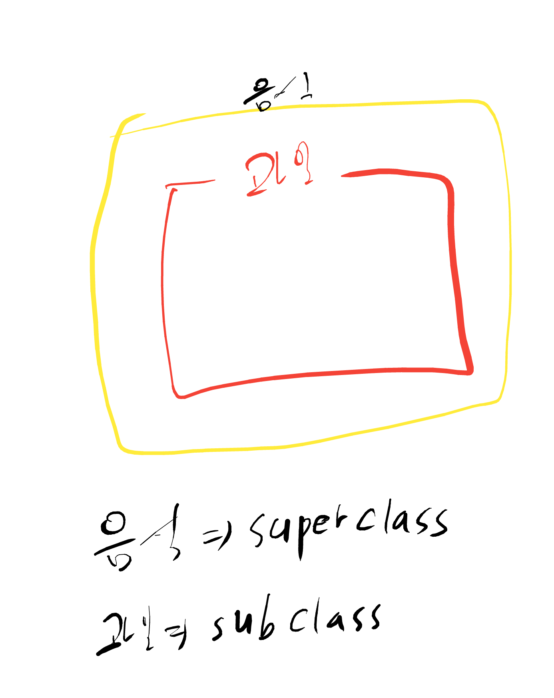
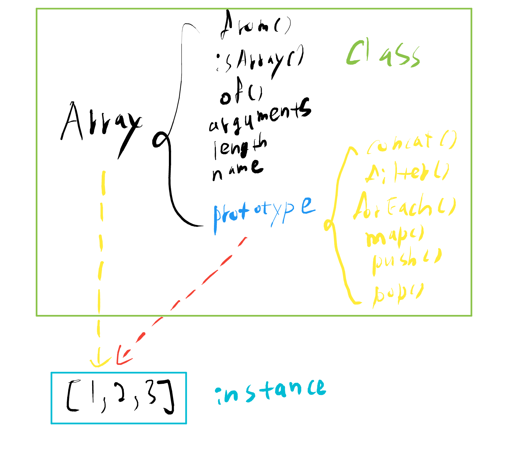
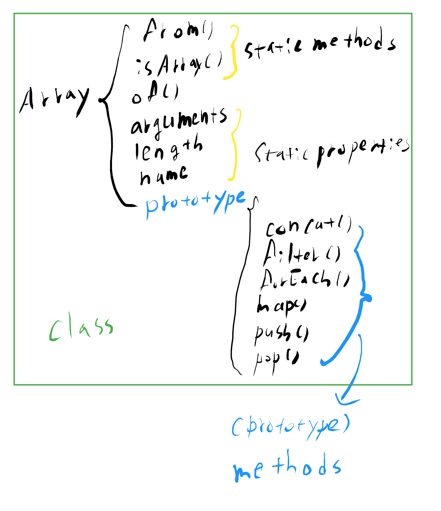
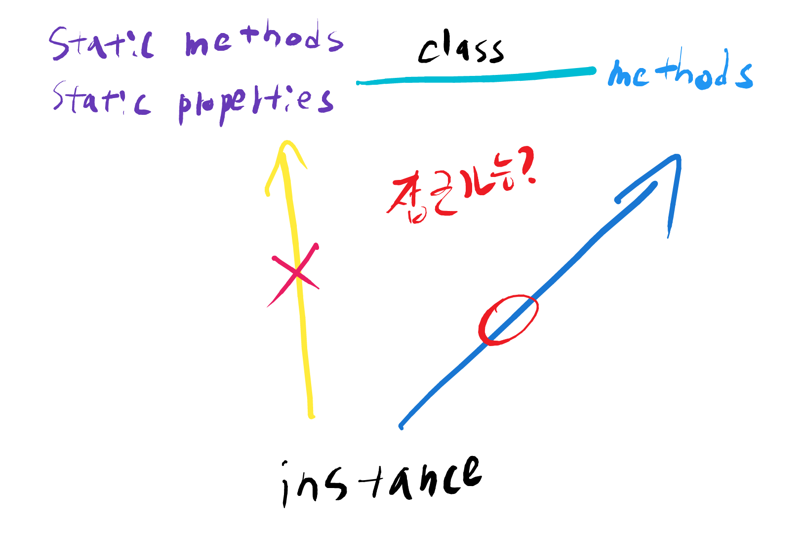

# 6-1. prototype static 메소드 및 static 프로퍼티

CLASS(계급. 집단. 집합)

인스턴스 : 공통적인 속성을 가진 구체적인 대상

클래스 : 인스턴스들의 공통 속성을 모은 추상적인 개념

본 강의 예제1

    function Person(name, age) {
        this._name = name;
        this._age = age;
    }
    Person.getInformations = function(instance) {
        return {
            name: instance._name,
            age: instance._age
        };
    }
    Person.prototype.getName = function() {
        return this._name;
    }
    Person.prototype.getAge = function() {
        return this._age;
    }
    
    var gomu = new Person('고무', 30);
    
    console.log(gomu.getName());    // OK
    console.log(gomu.getAge());     // OK
    
    console.log(gomu.getInformations(gomu));    // Error
    
    console.log(Person.getInformations(gomu));  // OK