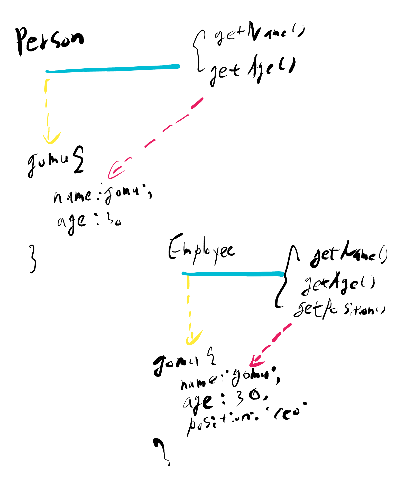
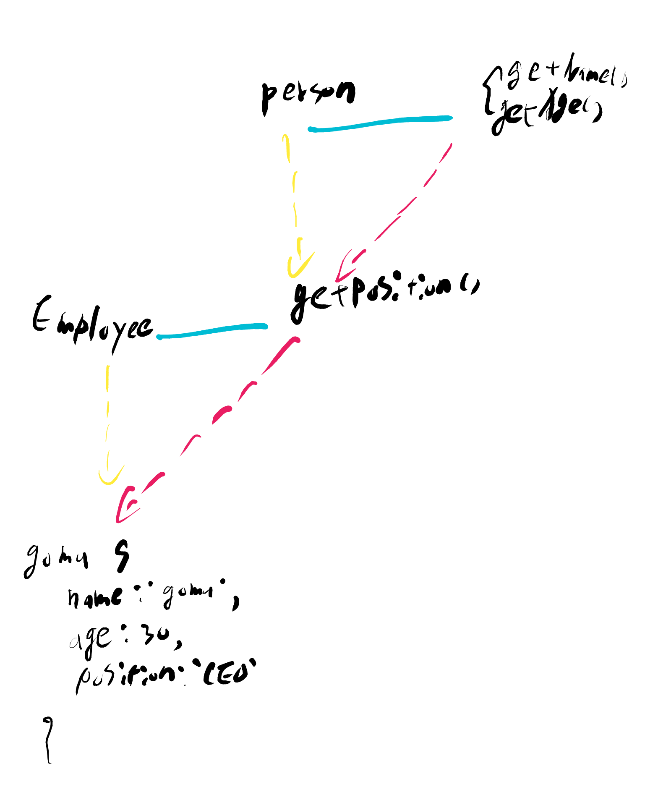
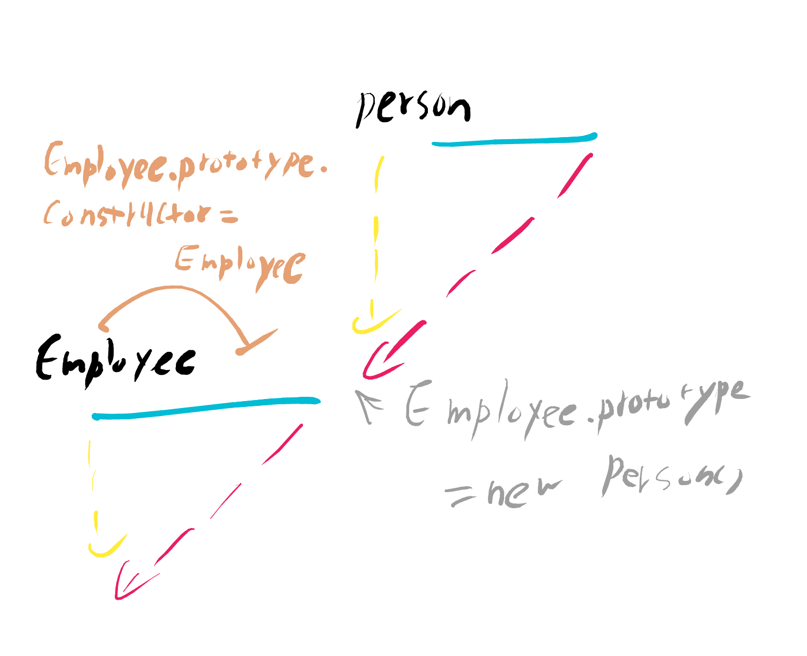
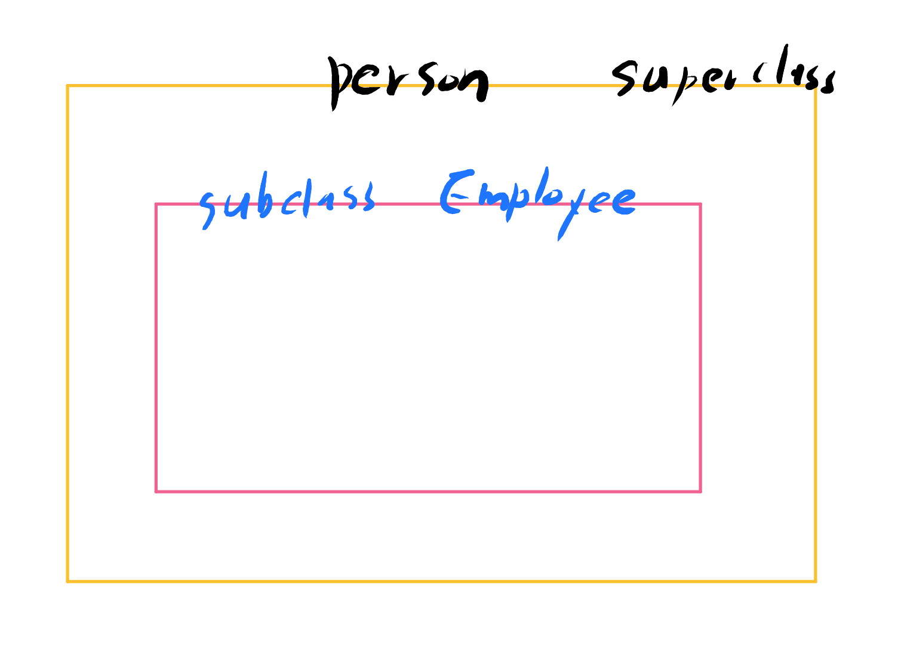
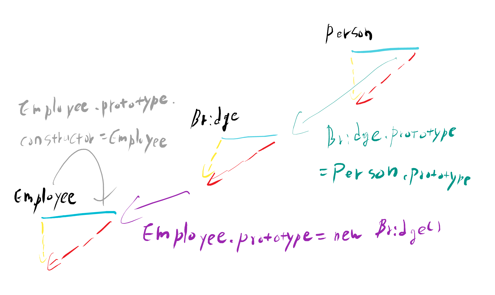

# 6-1. prototype static 메소드 및 static 프로퍼티

CLASS(계급. 집단. 집합)

인스턴스 : 공통적인 속성을 가진 구체적인 대상

클래스 : 인스턴스들의 공통 속성을 모은 추상적인 개념

본 강의 예제1

    function Person(name, age) {
        this._name = name;
        this._age = age;
    }
    Person.getInformations = function(instance) {
        return {
            name: instance._name,
            age: instance._age
        };
    }
    Person.prototype.getName = function() {
        return this._name;
    }
    Person.prototype.getAge = function() {
        return this._age;
    }
    
    var gomu = new Person('고무', 30);
    
    console.log(gomu.getName());    // OK
    console.log(gomu.getAge());     // OK
    
    console.log(gomu.getInformations(gomu));    // Error
    
    console.log(Person.getInformations(gomu));  // OK
    
# 6-2. class 상속 구현

본 강의 예제1

    function Person(name, age) {
        this.name = name || '이름없음';
        this.age = age || '나이모름';
    }
    
    Person.prototype.getName = function() {
        return this.name;
    }
    Person.prototype.getAge = function() {
        return this.age;
    }
    
    function Employee(name, age, position) {
        this.name = name || '이름없음';
        this.age = age || '나이모름';
        this.position = position || '직책모름';
    }
    Employee.prototype.getName = function() {
        return this.name;
    }
    Employee.prototype.getPosition = function() {
        return this.position;
    }
    

본 강의 예제2

    function Person(name, age) {
        this.name = name || '이름없음';
        this.age = age || '나이모름';
    }
    Person.prototype.getName = function() {
        return this.name;
    }
    Person.prototype.getAge = function() {
        return this.age;
    }
    
    function Employee(name, age, position) {
        this.name = name || '이름없음';
        this.age = age || '나이모름';
        this.position = position || '직책모름';
    }
    
    Employee.prototype = new Person();
    Employee.prototype.constructor = Employee;
    Employee.prototype.getPosition = function() {
        return this.position;
    }
    var gomu = new Employee('고무', 30, 'CEO');
    console.dir(gomu);
    

본 강의 예제3

    function Person(name, age) {
        this.name = name || '이름없음';
        this.age = age || '나이모름';
    }
    Person.prototype.getName = function() {
        return this.name;
    }
    Person.prototype.getAge = function() {
        return this.age;
    }
    
    function Employee(name, age, position) {
        this.name = name || '이름없음';
        this.age = age || '나이모름';
        this.position = position || '직책모름';
    }
    
    function Bridge() {}
    Bridge.prototype = Person.prototype;
    Employee.prototype = new Bridge();
    Employee.prototype.constructor = Employee;
    
    Employee.prototype.getPosition = function(){
        return this.position;
    }
    
    var gomu = new Employee('고무', 30, 'CEO');
    console.dir(gomu);
    
ES5에서는 Bridge를 많이 사용하기 때문에 더글라스는 아래와 같이 함수를 만들어 사용할 것을 권장함

    var extendClass = (function() {
        function Bridge(){}
        return function(Parent, Child) {
            Bridge.prototype = Parent.prototype;
            Child.prototype = new Bridge();
            Child.prototype.constructor = Child;
        }
    })();
    
본 강의 예제4

    function Person(name, age) {
        this.name = name || '이름없음';
        this.age = age || '나이모름';
    }
    Person.prototype.getName = function() {
        return this.name;
    }
    Person.prototype.getAge = function() {
        return this.age;
    }
    
    function Employee(name, age, position) {
        this.name = name || '이름없음';
        this.age = age || '나이모름';
        this.position = position || '직책모름';
    }
    
    var extendClass = (function() {
        function Bridge(){}
        return function(Parent, Child) {
            Bridge.prototype = Parent.prototype;
            Child.prototype = new Bridge();
            Child.prototype.constructor = Child;
        }
    })();
    extendClass(Person, Employee);
    Employee.prototype.getPosition = function(){
        return this.position;
    }
    
    var gomu = new Employee('고무', 30, 'CEO');
    console.dir(gomu);
    
본 강의 예제5

    var extendClass = (function() {
        function Bridge(){}
        return function(Parent, Child) {
           Bridge.prototype = Parent.prototype;
           Child.prototype = new Bridge();
           Child.prototype.constructor = Child;
           Child.prototype.superClass = Parent;
        }
    })();
    function Person(name, age) {
        this.name = name || '이름없음';
        this.age = age || '나이모름';
    }
    Person.prototype.getName = function() {
        return this.name;
    }
    Person.prototype.getAge = function() {
        return this.age;
    }
    function Employee(name, age, position) {
        this.superClass(name, age);
        this.position = position || '직책모름';
    }
    extendClass(Person, Employee);
    Employee.prototype.getPosition = function(){
        return this.position;
    }
    
    var gomu = new Employee('고무', 30, 'CEO');
    console.dir(gomu);
    
본 강의 예제6(ES6)

    class Person {
        constructor (name, age) {
            this.name = name || '이름없음';
            this.age = age || '나이모름';
        }
        getName () {
            return this.name();
        }
        getAge () {
            return thus.age;
        }
    }
    class Employee extends Person {
        constructor (name, age, position) {
            super(name, age);
            this.position = position || '직책모름';
        }
        getPosition () {
            return this.position;
        }
    }